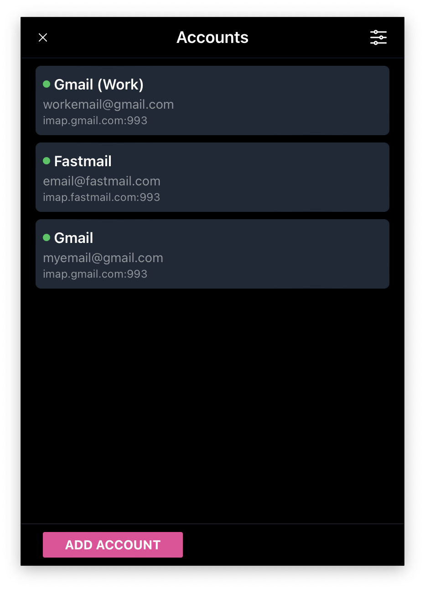

# MailWatch

> [!WARNING]  
> Work in progress!

MailWatch is a system tray application that provides real-time notifications for unseen emails across multiple email accounts.

App built with [Tauri](https://tauri.app/), [Vue](https://vuejs.org/), [Vite](https://vitejs.dev/), [TailwindCSS](https://tailwindcss.com/). Icon generated by DALL·E 3.

## Dev

```sh
# Install dependencies
pnpm install

# Development mode
pnpm tauri dev
```

## Build

```sh
# Install dependencies
pnpm install

# Build frontend and backend applications
pnpm tauri build
```

## License

MailWatch is open-sourced software licensed under the [MIT](./LICENSE) license.
